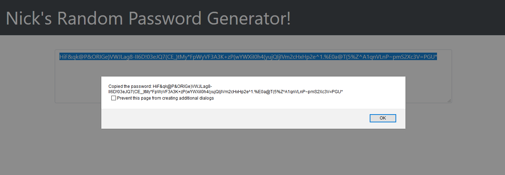

# Password-Generator

## About

This is a basic random password generator! The purpose is to ask the user which types of characters they would like to use, and how many characters to include. If the user does not choose at least one character type, or if the character count falls outside of the specified range, the user will be alerted and the cycle will refresh. If the user completes all inputs, the text field on the page will update with a random password generated based on the user inputs. The user may also copy the password to their system's clipboard by clicking the "Copy to Clipboard" button.

## Screenshot

## Technology

The random password generator was created with:

- HTML
- Bootstrap CSS
- JavaScript

## Link

https://marauder30.github.io/password-generator/

## Author

[Nicholas Koch](https://marauder30.github.io/)
